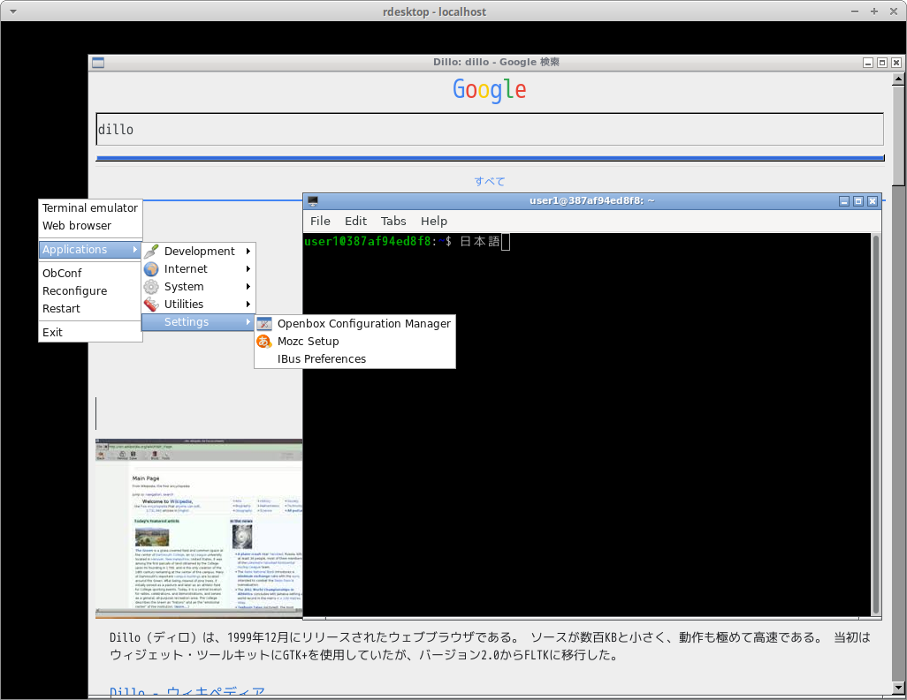
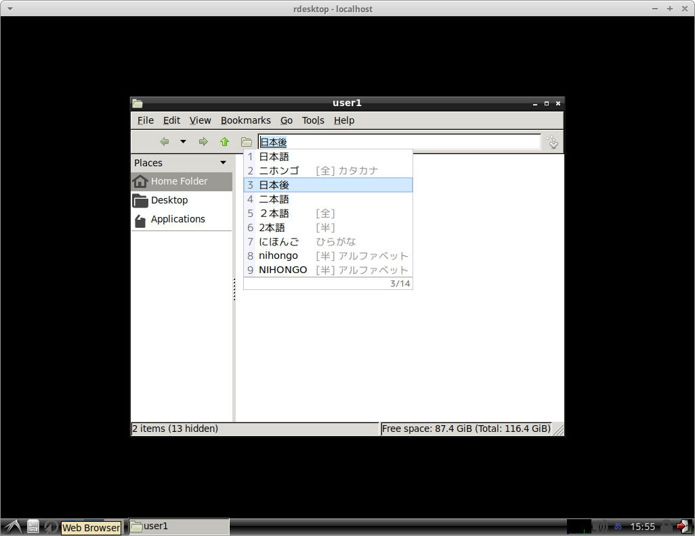
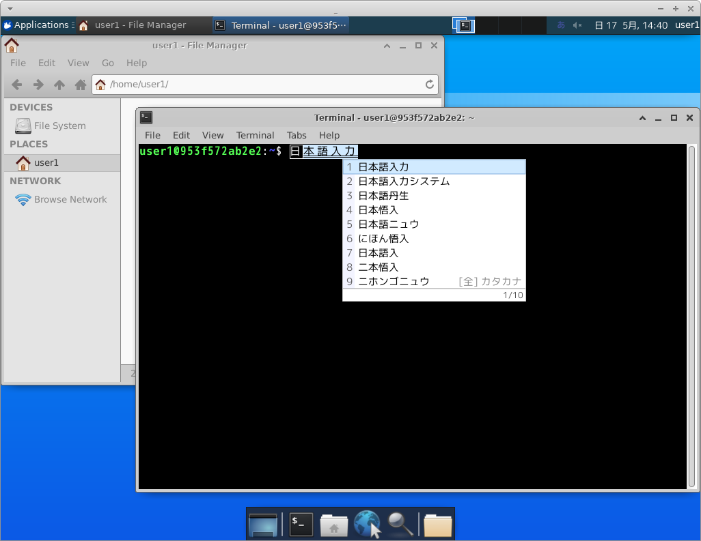
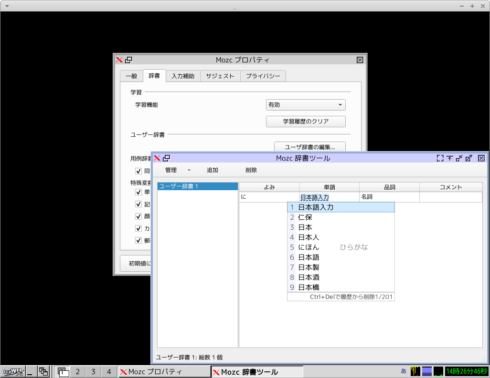

# docker-xrdp

* [Dockerhub](https://hub.docker.com/repository/docker/tukiyo3/xrdp)
* [Github](https://github.com/tukiyo/docker-xrdp)

## 使い方

```sh
# openbox
docker run -p 3389:3389 tukiyo3/xrdp:core
```

or

```
# google-chrome
docker run -p 3389:3389 --cap-add SYS_ADMIN -v /dev/shm:/dev/shm tukiyo3/xrdp:chrome
```

| 項目 | 初期値 | 備考 |
|:--|:--|:--|
| UID | 1000 |
| GID | 1000 |
| USER | focal |
| PASSWD | 自動生成 |

### アカウント指定

```sh
docker run -it --rm \
    --name xrdp \
    -u $(id -u):$(id -g) \
    -e USER=user1 \
    -e PASSWD=hogehoge \
    -p 3389:3389 \
  tukiyo3/xrdp:lxde
```

引数

| 項目 | 初期値 | 備考 |
|:--|:--|:--|
| GITHUB_USER | GITHUBに登録している公開鍵を~/.ssh/authorized_keys に追加 |

## サンプル






## 解像度変更について

* xfce4 は リモート接続の解像度変更に対応しています。
* icewm は 解像度の変更に対応していません。解像度変更したい場合はログアウトするか icewm を立ち上げ直してください。

## 一歩進んだ使い方

custom/ を参照。

* /dev/fuse : クリップボードに必要
* /dev/shm : chromeやfirefoxがクラッシュしないように割当を増やすかホストのものを使う。
* DAC_READ_SEARCH : smbmount 使用時に必要
* SYS_ADMIN : chrome 使用時に必要
* ALL : TeamViewer に必要 (※ 有効にしたが、「使用中のID」は - のままだった。なにか足りない)


## ビルド方法

```sh
git clone https://github.com/tukiyo/docker-xrdp
cd custom
sh build.sh
```


## 他のウィンドウマネージャに変更

* Dockerfile/icewm に以下コメントアウトし追記
* `sh bin/build.sh`

```sh
# xfce4 (メモリ使用量 xfce4 起動時 189 MiB)

# 例: Window Manager を起動せずに xrdp ログイン直後 (メモリ使用量 xfce4 起動時 81 MiB)
# RUN sed -i -e "s@^xfce4-session@tail -f /dev/null@" /etc/skel/.xsession

# 例: i3 を使いたい場合
# RUN pkgadd.sh i3 && sed -i -e "s@^xfce4-session@i3@" /etc/skel/.xsession
```

| 項目 | 起動時の<br>メモリ使用量 (MiB) |
|:--|--:|
| xrdpログイン直後 | 81 |
| openbox | 91 |
| icewm | 91 |
| lxde | 125 |
| xfce4 | 189 |
| xfce4でchrome起動時 | 330 |

## thanks !

* [docker-ubuntu-lxde/xrdp at master · yama07/docker-ubuntu-lxde](https://github.com/yama07/docker-ubuntu-lxde/tree/master/xrdp)
